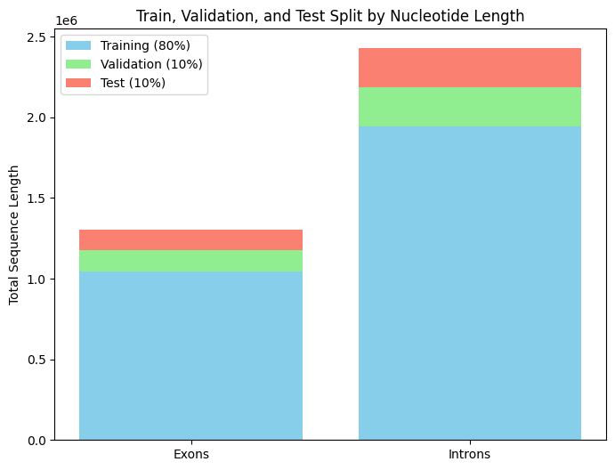
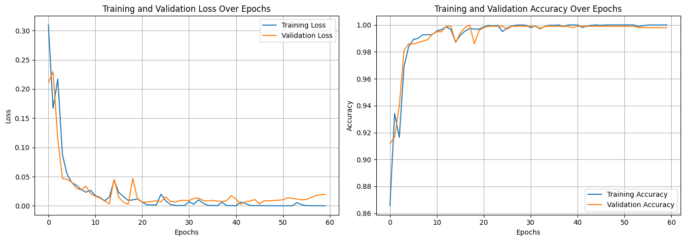

🧬 Exon & Intron Classification Using BI-LSTM | Genomic Sequence Analysis with Deep Learning

This project implements a Bidirectional LSTM (BI-LSTM) neural network to classify exonic and intronic regions in human DNA sequences using character-level sequence modeling. It includes a complete ETL pipeline, dataset preprocessing from FASTA to CSV, baseline model comparisons (RNN, LSTM, GRU), and visualization of training progress.

Originally developed for a scientific paper accepted at a bioinformatics conference in Portugal, the project focuses on reproducibility and performance benchmarking using real-world genomic data sourced from the Ensembl Genome Browser.

## Table of Contents
1. [Model Overview](#model-overview)
2. [ETL Pipeline (Data Preparation)](#etl-pipeline-data-preparation)
3. [Final BI-LSTM Model Architecture](#final-bi-lstm-model-architecture)
4. [Baseline Evaluation](#baseline-evaluation)
5. [Data Description](#data-description)
6. [Conclusion](#conclusion)
7. [License](#license)

---

## Model Overview

The goal of this project is to accurately distinguish between **exons (coding regions)** and **introns (non-coding regions)** in DNA sequences using deep learning techniques. Among several models tested, the **BI-LSTM** architecture showed the best performance in terms of accuracy and generalization.

---

## ETL Pipeline (Data Preparation)

The ETL pipeline was designed to transform raw biological data from the **FASTA** format into a format compatible with RNN-based models.

### 1. Extract
- **Source**: [Ensembl Genome Browser](https://www.ensembl.org)
- **Genes included**: `ANKRD1`, `PGK1`, `B2M`, `GAPDH`, `PPIA`, `RPLA13A`, `NEB`, `TTN`
- **Format**: FASTA files containing nucleotide sequences labeled by region (exon/intron)

### 2. Transform
Each FASTA file was parsed and transformed into a structured CSV file, following these steps:
- **Gene label extraction** using regex from FASTA headers
- **Binary labeling**: exon = 1, intron = 0
- **Intron masking** for gene IDs not present in intronic regions
- **Feature engineering**: adding metadata such as `start`, `end`, `length`, and `sequence`
- **Cleaning** and standardization to create uniform-length input sequences

🛠️ Code: [featureExtraction.py](https://github.com/arielabade/carbon/blob/main/code/dataPreparation/featureExtraction.py)

### 3. Load
- After preprocessing, sequences were tokenized (character-level) and padded to a **maximum length of 500** nucleotides.
- Data was split using `train_test_split`:
  - 80% Training
  - 10% Validation
  - 10% Testing
- Sequences were processed in **chunks of 1000** to improve memory efficiency.

---

## Final BI-LSTM Model Architecture

The final model was implemented using **TensorFlow and Keras**, with the following structure:

| Layer                  | Configuration                                                      |
|------------------------|--------------------------------------------------------------------|
| **Embedding**          | `input_dim = vocab_size`, `output_dim = 32`, `input_length = 500` |
| **Bi-LSTM Layer 1**    | 32 units, `return_sequences=True`                                 |
| **Dropout Layer**      | Dropout rate = 0.2                                                 |
| **Bi-LSTM Layer 2**    | 32 units                                                           |
| **Dropout Layer**      | Dropout rate = 0.2                                                 |
| **Dense Layer**        | 64 units, `activation='relu'`                                     |
| **Output Layer**       | 1 unit, `activation='sigmoid'`                                     |

### Training Details
- **Epochs**: 60
- **Batch Size**: 16
- **Optimizer**: Adam (default learning rate)
- **Loss Function**: Binary Crossentropy
- **Tokenization**: Character-level (A, T, G, C, etc.)
- **Padding**: Post-padding of sequences up to 500 characters
- **Evaluation Metrics**: Accuracy, Precision, Sensitivity (Recall), Specificity, F1-Score

### Visualization
The training process includes real-time visualization of:
- **Training vs. Validation Loss**
- **Training vs. Validation Accuracy**

📈 These plots confirm that the model generalizes well without overfitting, respecting the converging graphics between validation and loss.

---

## Baseline Evaluation

To validate the BI-LSTM model, it was compared with three other RNN-based architectures: **Simple RNN**, **LSTM**, and **GRU**. All models were trained under the same conditions and evaluated on the same dataset splits.

| Model        | Accuracy | Precision | Sensitivity | Specificity | F1-Score |
|--------------|----------|-----------|-------------|-------------|----------|
| Simple RNN   | 0.6820   | 0.6216    | 0.9981      | 0.3375      | 0.7661   |
| LSTM         | 0.9860   | 0.9810    | 0.9923      | 0.9790      | 0.9866   |
| GRU          | 0.9960   | 0.9981    | 0.9942      | 0.9979      | 0.9961   |
| **BI-LSTM**  | **0.9980** | **1.0000** | **0.9961**   | **1.0000**   | **0.9981** |

📁 Scripts for each model:
- [Simple RNN](https://github.com/arielabade/carbon/blob/main/code/baselineEvaluation/60epochs/simpleRNN60epochs.py)
- [LSTM](https://github.com/arielabade/carbon/blob/main/code/baselineEvaluation/60epochs/lstm60epochs.py)
- [GRU](https://github.com/arielabade/carbon/blob/main/code/baselineEvaluation/60epochs/GRU60epochs.py)
- [BI-LSTM](https://github.com/arielabade/carbon/blob/main/code/baselineEvaluation/60epochs/biLSTM30epochs.py)

---

## Data Description

The final dataset included **9,971 sequences**, evenly distributed between exons and introns, from eight genes. The sequences were balanced in quantity and diversity to ensure generalization.

| Gene     | Exons | Introns | Total Sequences | Exonic Bases | Intronic Bases |
|----------|-------|---------|------------------|---------------|----------------|
| ANKRD1   | 9     | 8       | 17               | 1,790         | 7,202          |
| PGK1     | 37    | 31      | 68               | 9,539         | 339,889        |
| B2M      | 40    | 28      | 68               | 10,553        | 51,222         |
| GAPDH    | 79    | 68      | 147              | 13,269        | 21,371         |
| PPIA     | 80    | 62      | 142              | 34,258        | 80,547         |
| RPLA13A  | 123   | 101     | 224              | 29,782        | 54,231         |
| NEB      | 844   | 823     | 1,667            | 119,394       | 1,106,064      |
| TTN      | 3,822 | 3,807   | 7,629            | 1,247,226     | 2,273,905      |
| **Total**| 5,034 | 4,928   | **9,971**         | 1,469,811     | 3,885,762      |

📂 Data files (FASTA and CSV): [Available here](https://github.com/arielabade/carbon/tree/main/data)

---

## Conclusion

The **BI-LSTM** architecture demonstrated superior performance in distinguishing exons from introns, with a final accuracy of **99.80%**. This positions it as a strong candidate for use in bioinformatics pipelines, gene structure analysis, and even medical genomics research.

The project emphasizes:
- 🔍 Transparency via open-source code and data
- 🔁 Reproducibility through complete ETL steps
- 📈 Scientific rigor in metric evaluation and cross-model comparison

# 📝 Notes

    This project was developed as part of a research initiative and was accepted for presentation at an international conference in Portugal.
    To access the full paper, feel free to contact me via email: arielabadebandeira@gmail.com

    One of the main challenges during development was finding comparable research papers with similar approaches and consistent evaluation metrics.

    Another significant difficulty was obtaining reliable and publicly available genomic datasets, especially for cross-testing against other models.

    Most related studies used in-house datasets and unfortunately did not provide access to their training or testing data, nor the full implementation details.
    As a result, it was difficult to establish fair comparisons or assess how well those external models actually performed in practice.

📬 For more information, contact: **arielabadebandeira@gmail.com**

