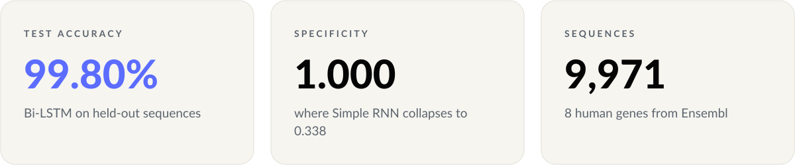
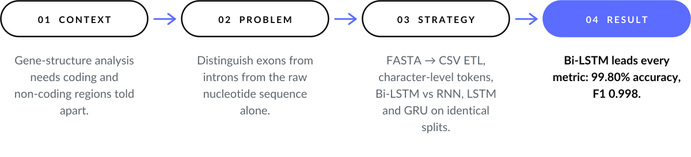
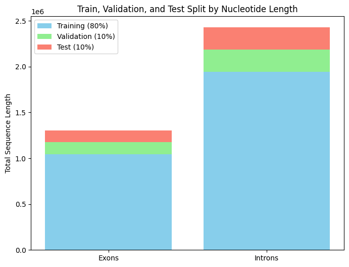
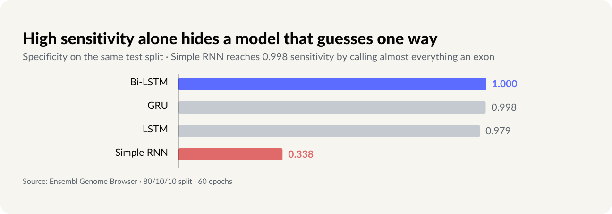
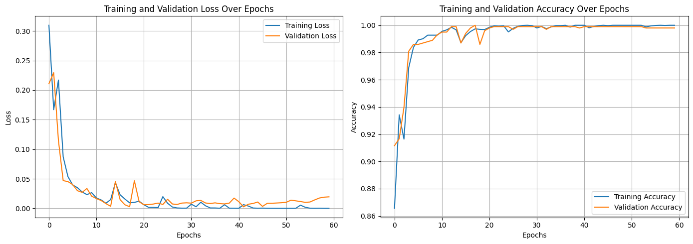

<p align="center">
  <picture>
    <source media="(prefers-color-scheme: dark)" srcset="assets/brand/header-dark.svg">
    
  </picture>
</p>

<p align="center">
  
  
  
  
</p>

**A bidirectional LSTM reads DNA as a sequence and separates coding from non-coding regions with
99.80% test accuracy.** It leads three controlled baselines on every metric. The paper was accepted at
an international bioinformatics conference in Portugal.

<p align="center">
  <picture>
    <source media="(prefers-color-scheme: dark)" srcset="assets/brand/kpis-dark.svg">
    
  </picture>
</p>

<p align="center">
  <picture>
    <source media="(prefers-color-scheme: dark)" srcset="assets/brand/arc-dark.svg">
    
  </picture>
</p>

---

## 01 — Context

Gene-structure analysis depends on telling **exons** (coding regions) from **introns** (non-coding
regions). Most published approaches rely on in-house datasets with no public training or test data,
which makes fair comparison difficult.

### Data

Real genomic sequences from the [Ensembl Genome Browser](https://www.ensembl.org): **9,971 sequences**
from eight human genes, balanced between exons and introns.

| Gene | Exons | Introns | Total sequences | Exonic bases | Intronic bases |
|------|-------|---------|-----------------|--------------|----------------|
| ANKRD1 | 9 | 8 | 17 | 1,790 | 7,202 |
| PGK1 | 37 | 31 | 68 | 9,539 | 339,889 |
| B2M | 40 | 28 | 68 | 10,553 | 51,222 |
| GAPDH | 79 | 68 | 147 | 13,269 | 21,371 |
| PPIA | 80 | 62 | 142 | 34,258 | 80,547 |
| RPLA13A | 123 | 101 | 224 | 29,782 | 54,231 |
| NEB | 844 | 823 | 1,667 | 119,394 | 1,106,064 |
| TTN | 3,822 | 3,807 | 7,629 | 1,247,226 | 2,273,905 |
| **Total** | 5,034 | 4,928 | **9,971** | 1,469,811 | 3,885,762 |

---

## 02 — Problem

Classify each region as exon or intron **from the raw nucleotide sequence alone**, and show that the
result holds against controlled baselines trained under identical conditions, not just against
numbers reported on other datasets.

---

## 03 — Strategy

**ETL, FASTA to model-ready tensors** ([`featureExtraction.py`](data/featureExtraction/featureExtraction.py))

| Step | What happens |
| --- | --- |
| Extract | FASTA files per gene, labelled by region, from Ensembl |
| Transform | Gene label via regex from headers · binary label (exon = 1, intron = 0) · intron masking · `start`, `end`, `length`, `sequence` metadata · cleaning |
| Load | Character-level tokens · post-padding to **500** nucleotides · 80/10/10 split · processing in chunks of 1,000 |



**Final model** ([`carbonFinalModel.py`](code/biLSTM/carbonFinalModel.py)), TensorFlow/Keras:

| Layer | Configuration |
|-------|---------------|
| Embedding | `output_dim = 32`, `input_length = 500` |
| Bi-LSTM 1 | 32 units, `return_sequences=True` · Dropout 0.2 |
| Bi-LSTM 2 | 32 units · Dropout 0.2 |
| Dense | 64 units, ReLU |
| Output | 1 unit, sigmoid |

60 epochs · batch 16 · Adam · binary cross-entropy. Metrics: accuracy, precision, sensitivity,
specificity, F1.

**Controlled baselines.** Simple RNN, LSTM and GRU trained on the same splits, tokenisation and epochs
([scripts](code/baselineEvaluation/60epochs/)).

---

## 04 — Result

<p align="center">
  <picture>
    <source media="(prefers-color-scheme: dark)" srcset="assets/brand/chart-dark.svg">
    
  </picture>
</p>

| Rank | Model | Accuracy | Precision | Sensitivity | Specificity | F1-score |
|------|-------|----------|-----------|-------------|-------------|----------|
| 1 | **Bi-LSTM** | **0.9980** | **1.0000** | **0.9961** | **1.0000** | **0.9981** |
| 2 | GRU | 0.9960 | 0.9981 | 0.9942 | 0.9979 | 0.9961 |
| 3 | LSTM | 0.9860 | 0.9810 | 0.9923 | 0.9790 | 0.9866 |
| 4 | Simple RNN | 0.6820 | 0.6216 | 0.9981 | 0.3375 | 0.7661 |

Simple RNN has the highest sensitivity in the group (0.9981) only because it calls almost everything an
exon: its specificity is 0.3375. Reading the two together separates a model that discriminates from
one that guesses in one direction.



Training and validation curves converge without divergence, so the model generalises rather than
memorises.

### Literature context

These results must not be interpreted as a strict leaderboard: the studies use different organisms, gene sets, sequence encodings, train/test protocols, and sometimes a related prediction task rather than the same exon/intron classification problem. The external values are reported results, not re-runs of their models in this repository.

| Study / model | Task and representation | Reported accuracy | Comparison status | Reference |
|---------------|------------------------|-------------------|-------------------|-----------|
| **This repository — BI-LSTM** | Human exon/intron classification; Ensembl sequences; character-level encoding | **99.80%** | Reproduced locally | [`carbonFinalModel.py`](code/biLSTM/carbonFinalModel.py) |
| Singh, Nath & Singh (2021) — BI-LSTM-RNN | Human exon/intron prediction using splice-site signals and NCBI data | 96.00% | Related task; reported result | [IJETER paper](https://doi.org/10.30534/ijeter/2021/20932021) |
| Canatalay & Ucan (2022) — BI-LSTM/GRU | Exon prediction using splice-site mapping | 96.10% | Related task; reported result | [Applied Sciences paper](https://doi.org/10.3390/app12094390) |
| Gunasekaran et al. (2021) — CNN | General DNA sequence classification with label/k-mer encoding | 93.16% | Different classification scope; reported result | [Computational and Mathematical Methods in Medicine](https://doi.org/10.1155/2021/1835056) |
| Ben Nasr & Oueslati (2021) — CNN | Human exon/intron classification | ~90.00% | Same broad task; reported result | [SSD conference paper](https://doi.org/10.1109/SSD52085.2021.9429303) |
| Ben Nasr Barber & Oueslati (2024) — ResNet-50 | Human exon/intron classification from FCGR images | 92.00% | Same broad task; reported result | [Journal of Genetic Engineering and Biotechnology](https://doi.org/10.1016/j.jgeb.2024.100359) |
| Akalın & Yumuşak (2024) — SBERT + ANFIS | Exon/intron classification for BCR-ABL and MEFV sequences | 88.88% | Different genes and representation; reported result | [Journal of Polytechnic](https://doi.org/10.2339/politeknik.1187808) |

The controlled local comparison is the stronger scientific claim. The literature comparison suggests
strong relative performance, but datasets and protocols differ.

> **Outcome.** A reproducible Bi-LSTM pipeline for exon/intron classification, from public data to
> controlled benchmark, accepted for conference presentation.

---

## 05 — Limits and next move

- **Eight genes.** TTN and NEB contribute 93% of sequences, so results lean on two very large genes.
  A gene-held-out evaluation would test generalisation to unseen genes.
- **Cross-study numbers are not a leaderboard.** Organisms, gene sets, encodings and protocols differ.
- **Most related studies did not release data or code**, which limited external replication.
- **Next move:** gene-level cross-validation and a three-base-periodicity feature, from the literature
  below, as a biologically motivated input.

### References

The references below were extracted from the `refs.bib` file in the supplied ZIP archive and checked against the linked publisher, DOI, repository, or conference records. The final column records how each reference relates to this repository's files.

| Reference | Contribution to this project | Repository association |
|-----------|-----------------------------|------------------------|
| [Ensembl, *Homo sapiens Ensembl database*](https://www.ensembl.org/) | Source of the human genomic records used by the ETL pipeline. | [`data/fastaData/`](data/fastaData/), [`data/featureExtraction/featureExtraction.py`](data/featureExtraction/featureExtraction.py) |
| [Long & Deutsch (1999), *Intron-exon structures of eukaryotic model organisms*](https://doi.org/10.1093/nar/27.15.3219) | Biological background for exon/intron structure. | README background; no direct implementation. |
| [Abo-Zahhad, Ahmed & Abd-Elrahman (2012), *Genomic Analysis and Classification of Exon and Intron Sequences Using DNA Numerical Mapping Techniques*](https://doi.org/10.5815/ijitcs.2012.08.03) | Motivation for representing nucleotide sequences and classifying exon/intron regions. | [`data/featureExtraction/featureExtraction.py`](data/featureExtraction/featureExtraction.py), [`data/fastaData/`](data/fastaData/), [`data/csvData/`](data/csvData/) |
| [Mabrouk (2014), *A Novel Circular Mapping Technique for Spectral Classification of Exons and Introns in DNA Sequences*](https://doi.org/10.5815/ijitcs.2014.04.02) | Alternative DNA representation discussed in the paper. | Literature context only; no spectral-mapping implementation. |
| [Singh & Srivastava (2020), *The Three Base Periodicity of Protein Coding Sequences and its Application in Exon Prediction*](https://doi.org/10.1109/SPIN48934.2020.9071068) | Candidate biological feature for future feature engineering. | Future-work context; no periodicity feature file. |
| [Singh, Nath & Singh (2021), *Prediction of Eukaryotic Exons Using Bidirectional LSTM-RNN Based Deep Learning Model*](https://doi.org/10.30534/ijeter/2021/20932021) | Prior BI-LSTM-RNN exon-prediction architecture and external benchmark. | [`code/biLSTM/carbonFinalModel.py`](code/biLSTM/carbonFinalModel.py) |
| [Canatalay & Ucan (2022), *A Bidirectional LSTM-RNN and GRU Method to Exon Prediction Using Splice-Site Mapping*](https://doi.org/10.3390/app12094390) | Closest architectural reference for the BI-LSTM/GRU comparison. | [`code/biLSTM/carbonFinalModel.py`](code/biLSTM/carbonFinalModel.py), [`code/baselineEvaluation/60epochs/GRU60epochs.py`](code/baselineEvaluation/60epochs/GRU60epochs.py) |
| [Gunasekaran et al. (2021), *Analysis of DNA Sequence Classification Using CNN and Hybrid Models*](https://doi.org/10.1155/2021/1835056) | CNN and hybrid-model comparison for DNA sequence classification. | Benchmark context; no CNN implementation in this repository. |
| [Ben Nasr & Oueslati (2021), *CNN for Human Exons and Introns Classification*](https://doi.org/10.1109/SSD52085.2021.9429303) | CNN-based exon/intron baseline from the literature. | Benchmark context; no CNN implementation in this repository. |
| [Ben Nasr Barber & Oueslati (2024), *Human Exons and Introns Classification Using Pre-trained ResNet-50 and GoogleNet Models and 13-layers CNN Model*](https://doi.org/10.1016/j.jgeb.2024.100359) | Image-based CNN, ResNet-50, and GoogleNet alternatives. | Benchmark context; no image-model implementation in this repository. |
| [Akalın & Yumuşak (2024), *Classification of Exon and Intron Regions on DNA Sequences with Hybrid Use of SBERT and ANFIS Approaches*](https://doi.org/10.2339/politeknik.1187808) | Hybrid embedding/fuzzy-inference alternative using codon frequencies. | Benchmark context; no SBERT/ANFIS implementation in this repository. |
| [Sudha & Vijaya (2022), *Recurrent Neural Network Based Model for Autism Spectrum Disorder Prediction Using Codon Encoding*](https://doi.org/10.1007/s40031-021-00669-4) | Related recurrent/codon-encoding methodology; its target is gene/ASD classification rather than exon/intron classification. | [`code/baselineEvaluation/60epochs/lstm60epochs.py`](code/baselineEvaluation/60epochs/lstm60epochs.py) as architectural context only. |
| [Hill et al. (2018), *A Deep Recurrent Neural Network Discovers Complex Biological Rules to Decipher RNA Protein-Coding Potential*](https://doi.org/10.1093/nar/gky567) | Background for recurrent models learning biological sequence patterns. | [`code/biLSTM/carbonFinalModel.py`](code/biLSTM/carbonFinalModel.py) as methodological context. |
| [Ji et al. (2021), *DNABERT: Pre-trained Bidirectional Encoder Representations from Transformers Model for DNA-language in Genome*](https://doi.org/10.1093/bioinformatics/btab083) | Transformer-based alternative discussed in the paper. | Literature context only; no DNABERT implementation. |
| [Poddar et al. (2023), *Identifying DNA Sequence Motifs Using Deep Learning: DeepDeCode Model for Splice Site Prediction*](https://arxiv.org/abs/2311.12884) | Attention/deep-learning direction for splice-site prediction. | Literature context only; no DeepDeCode implementation. |

References such as BERT, GPT-4, ResNet-50, GoogleNet, GeneGPT, Ritch et al., and Quazi are retained as broader methodological or biomedical context in the source paper; they are not direct implementations or controlled baselines in this repository.

---

## Run it

The model scripts were written for **Google Colab** and read the gene CSVs from `/content/`.

```bash
git clone https://github.com/arielabade/carbon
```

1. Open a Colab notebook with a GPU runtime.
2. Upload the eight files from [`data/csvData/`](data/csvData/) to `/content/`.
3. Paste and run [`code/biLSTM/carbonFinalModel.py`](code/biLSTM/carbonFinalModel.py), or any baseline in
   [`code/baselineEvaluation/60epochs/`](code/baselineEvaluation/60epochs/).

To run locally, `pip install tensorflow pandas numpy scikit-learn matplotlib` and point the file list
at the top of each script to `data/csvData/`. To rebuild the CSVs from FASTA, set `file_path` and
`output_file` in [`featureExtraction.py`](data/featureExtraction/featureExtraction.py) first.

The full paper is available on request: **arielabadebandeira@gmail.com**.

## Repository map

```
data/fastaData/              raw FASTA per gene (Ensembl)
data/csvData/                parsed, labelled CSV per gene
data/featureExtraction/      the ETL script
data/trainTestValidation/    split files
code/biLSTM/                 final model
code/baselineEvaluation/     Simple RNN, LSTM, GRU and Bi-LSTM at 30 and 60 epochs
images/                      split and training-curve figures
```

---

<p align="center">
  <picture>
    <source media="(prefers-color-scheme: dark)" srcset="assets/brand/track-dark.svg">
    
  </picture>
</p>

<p align="center">
  <a href="https://github.com/arielabade">Portfolio</a> &nbsp;·&nbsp;
  <a href="https://github.com/arielabade/echo-womens-health-research-analytics">Research analytics →</a>
</p>
